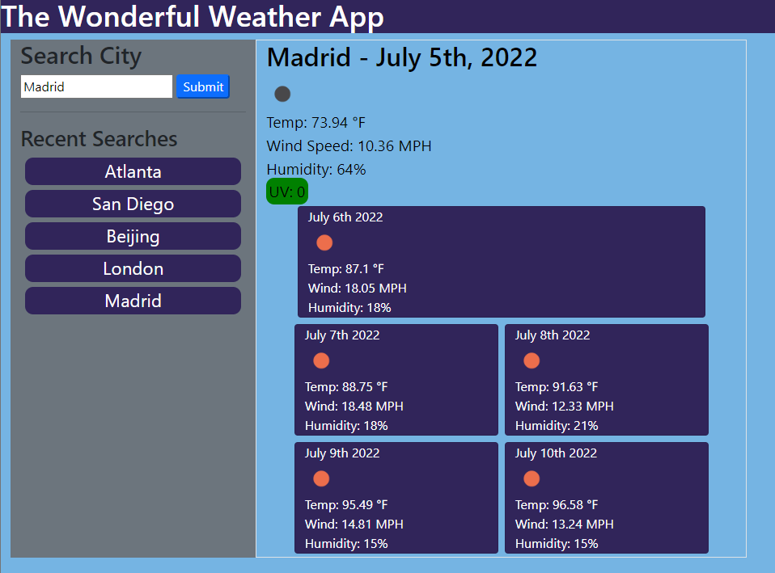

# Challenge-06-Weather App

Challenge 6 for Georgia Tech Coding bootcamp. This is a Weather App that allows the user to pull weather information for different cities using One Weather API

## Purpose

This can be used to obtain current weather information as well as a five day forecast for a given city. It can display an icon with current weather conditions, temperature, wind speed, humidity and UV index. It also saves recent searches in local storage so that they can be referenced again by clicking on them to obtain the previous results.

## Instructions

Type in the name of the city you wish to obtain weather information for. It will run the results through the One Weather API to pull weather data. The information will then save in recent searches and local storage so that the data can be referenced again if needed.

## APIs used

JQuery
Bootstrap
Moment.js
Open Weather API

## Deployed Site

```bash
https://huntersteffner.github.io/Weather-App/

```

## Screenshot



## Contributing

This project can be cloned and referenced as inspiration in creating another portfolio webpage. Please only use as a reference.
